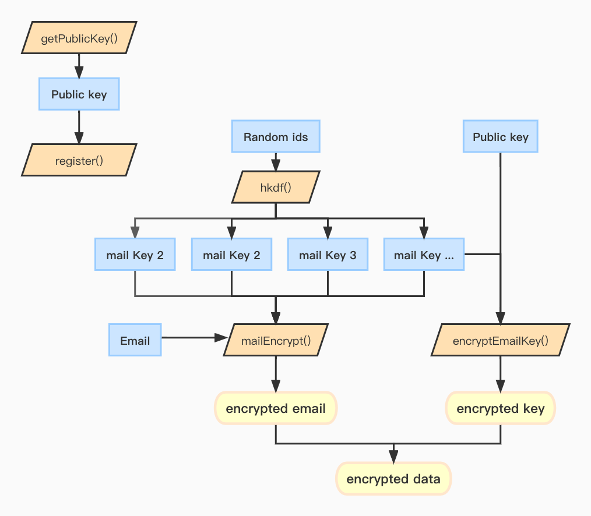

# W3Mail

## Introduction
W3Mail is a fully decentralized email service on the Web3Q chain. Users can send/receive email by wallet addresses, and the email contents are also stored on chain in plaintext or encrypted form. Plaintext emails can be sent to any address, while encrypted emails can only be sent to addresses that has registered the public key on chain.
   
W3Mail can be visited here: https://web3q.io/w3mail.w3q/.


## How does it work
W3Mail is a fully decentralized dApp which means the front-end code, back-end (smart contract) code and users' data (email content) are all stored on chain. 

### Front-end
The flow chart is as follows:


#### w3mail.w3q
[w3mail.w3q](https://web3q.io/w3ns.w3q/#/domains/w3mail.w3q) is a w3ns domain name, and the domain name corresponds to a FlatDirectory contract address, 
the front-end code is stored in this contract.

FlatDirectory is the implementation of the web3 storage data contract. Click [here](https://docs.web3q.io/tutorials/migrate-your-website-to-web3q-in-5-mins) for details.

#### Mail key
Each email has a random id, and an AES256 key which is derived from the id. This AES256 key is the Mail Key, which is used to encrypt the content of the email.
```
export async deriveMailKey(mailId) {
    const seed = new Uint16Array(8);
    window.crypto.getRandomValues(seed);
    const info = Buffer.from(parse(mailId));
    return hkdf(seed.buffer, keyByteLength, {info, hash: keyHash});
}
```

#### Public key
The email key is encrypted by the email receiver's public key and will be sent to the email receiver with the contents.
```
export async function getPublicKey(account) {
    return await window.ethereum.request({
        method: 'eth_getEncryptionPublicKey',
        params: [account],
    });
}
```
Call the encryption function in "Metamask" to encrypt the Mail Key with the public key.
```
import {encrypt} from '@metamask/eth-sig-util';

function encryptEmailKey(publicKey, data) {
    const enc = encrypt({
        publicKey: publicKey,
        data: ascii85.encode(data).toString(),
        version: 'x25519-xsalsa20-poly1305',
    });
    return Buffer.concat([
        Buffer.from(enc.ephemPublicKey, 'base64'),
        Buffer.from(enc.nonce, 'base64'),
        Buffer.from(enc.ciphertext, 'base64'),
    ]);
}
```

#### Send Mail
Generate a Mail Key, encrypt the Mail Key with the sender's and recipient's public keys, and then encrypt the mail content with the Mail Key.

After the Mail Key is encrypted, the length is fixed at 112 bits. It is placed before the content of the email and uploaded to the blockchain together.
```
const emailKey = await deriveMailKey(emailId);

// encrypt email key by receive user public key
const encryptSendKey = encryptEmailKey(sendPublicKey, Buffer.from(emailKey, 'base64'));
const encryptReceiveKey = encryptEmailKey(receivePublicKey, Buffer.from(emailKey, 'base64'));
// encrypt content
const encryptResult = await mailEncrypt(emailKey, message);

const encryptContent = Buffer.concat([
    encryptSendKey, // 112
    encryptReceiveKey, // 112
    Buffer.from(encryptResult.cipherIV, 'base64'), // 12
    encryptResult.data,
]);
const contract = MailContract(controller);
await contract.sendEmail(toAddress, true, emailId, title, encryptContent, fileId);
```

#### Read Mail
Obtain encrypted data from the contract, intercept [0,112) or [112,224) bits of data in the encrypted data, and decrypt it into Mail Key with the private key of the "Metamask" wallet.
```
async function decryptMailKey(account, data) {
    const structuredData = {
        version: 'x25519-xsalsa20-poly1305',
        ephemPublicKey: data.slice(0, 32).toString('base64'),
        nonce: data.slice(32, 56).toString('base64'),
        ciphertext: data.slice(56).toString('base64'),
    };
    const ct = `0x${Buffer.from(JSON.stringify(structuredData), 'utf8').toString('hex')}`;
    // Send request to MetaMask to decrypt the ciphertext
    return await window.ethereum.request({
        method: 'eth_decrypt',
        params: [ct, account],
    });
}
```
Then use the Mail Key to decrypt the content of the mail after 236 bits.
```
const contract = MailContract(contract);
const content = await contract.getEmailContent(fromAddress, mailId, 0);
const data = Buffer.from(content, 'hex');
// sent [0,112), inbox [112,224)
const mailKey = types === '1' ? data.slice(112, 224) : data.slice(0, 112);
const encryptKey = await decryptMailKey(account, mailKey);
const iv = data.slice(224, 236).toString('base64');
const contentData = data.slice(236, data.length);
await mailDecrypt(iv, encryptKey.toString('base64'), contentData);
```
<br>


### SimpleW3Mail
SimpleW3Mail is used to manage user mails.

#### Storage structure
```
contract SimpleW3Mail {
    struct User {
        bytes32 publicKey;
        address fdContract;
    
        Email[] sentEmails;
        mapping(bytes => uint256) sentEmailIds;
        Email[] inboxEmails;
        mapping(bytes => uint256) inboxEmailIds;
        mapping(bytes => File) files;
    }
    mapping(address => User) userInfos; // // User upload info mapping
}
```

#### Register
Before sending emails, you need to submit your public key for registration.
```
function register(bytes32 publicKey) public {
    User storage user = userInfos[msg.sender];
    require(user.fdContract == address(0), "Address is registered");
    user.publicKey = publicKey;
    FlatDirectory fileContract = new FlatDirectory(0);
    user.fdContract = address(fileContract);

    // default email
    Email memory dEmail;
    dEmail.time = block.timestamp;
    ...
    dEmail.title = 'Welcome to W3Mail!';
    // add email
    user.inboxEmails.push(dEmail);
}
```

#### Send
```
// create email
Email memory email;
email.isEncryption = isEncryption;
...
email.fileUuid = fileUuid;

// add email
fromInfo.sentEmails.push(email);
toInfo.inboxEmails.push(email);
...

// write email
FlatDirectory fileContract = FlatDirectory(fromInfo.fdContract);
fileContract.writeChunk{value: msg.value}(getNewName(uuid, 'message'), 0, encryptData);
```
